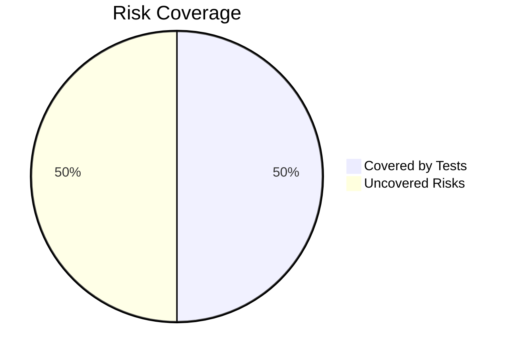
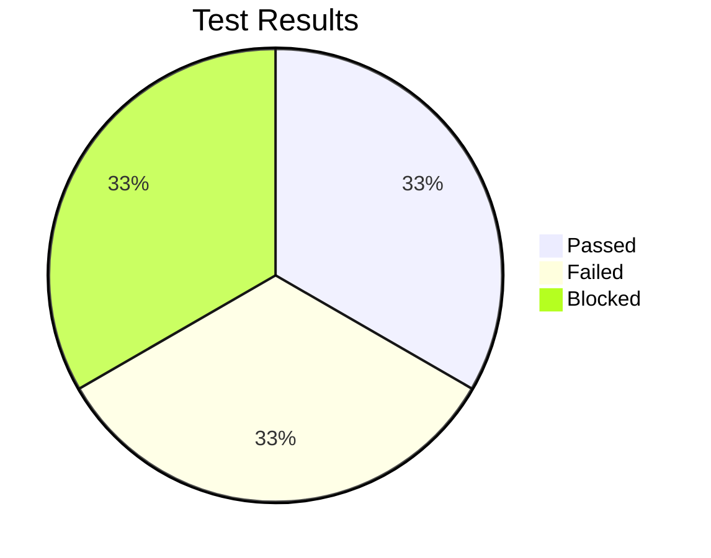

# 🧪 Test Management Report: Word Puzzle Game Draft
**Student Name**: [Your Name]  
**Date**: [YYYY-MM-DD]  

---

## 📋 **1. Test Plan**  

### 1.1 Objectives  
Verify that:  
- [ ] Word scrambling never reveals the original word  
- [ ] Scoring system applies correct points (10 for direct solve, 5 with hint)  
- [ ] Hint system properly deducts 2 points  
- [ ] Game handles empty/malformed input gracefully  

### 1.2 Scope  
```markdown
| **In Scope**               | **Out of Scope**          |  
|----------------------------|---------------------------|  
| Core game logic            | Browser compatibility     |  
|                            |                           |  
|                            |                           |  
```

### 1.3 Resources  
```markdown
- **Tester**: [Your Name]  
- **Tools**: Chrome DevTools, JavaScript Console  
- **Test Data**: 10-word JSON bank  
```

### 1.4 Schedule  
```markdown
| Phase              | Time (mins) | Start/End Time |  
|--------------------|------------|-----------------|  
| Test Planning      | 45         | 09:00-09:45     |  
| Risk Analysis      |            |                 |  
| Test Execution     |            |                 |  
| Defect Reporting   |            |                 |  
```

### 1.5 Entry/Exit Criteria  
```markdown
| **Phase**         | **Entry Criteria**               | **Exit Criteria**                     |  
|-------------------|----------------------------------|---------------------------------------|  
| Functional Testing| Game loads in Chrome             | All critical test cases passed        |  
|                   |                                  |                                       |  
```

---

## ⚠️ **2. Risk Analysis**  

### 2.1 Risk Matrix  
```markdown
| ID  | Feature        | Risk                          | Likelihood | Impact | Priority | Mitigation Strategy          |  
|-----|----------------|-------------------------------|------------|--------|----------|------------------------------|  
| R1  | Scoring        | Incorrect point calculation   | Medium     | High   | Critical | Boundary value testing       |  
|     |                |                               |            |        |          |                              | 
```

### 2.2 Risk Coverage  


---

## 🧪 **3. Test Cases**  

### 3.1 High-Priority Tests (Risk-Based)  

#### **TC-01: Hint Point Deduction**  
```markdown
- **Steps**:  
  1. Solve puzzle without hint → Score = 10  
  2. Solve identical puzzle with hint  
- **Expected**: Second score = 8  
- **Actual**: [Your Observation]  
- **Status**: Pass/Fail  
```

---

## 🐞 **4. Defect Reports**  

### 4.1 GitHub Issue Links  
```markdown
1. [#1: Score Accumulation Bug](https://github.com/your-repo/issues/1)  
   - **Severity**: High  
   - **Risk Impact**: R1 (Scoring system)  

2. [#2: Empty Input Accepted](https://github.com/your-repo/issues/2)  
   - **Severity**: Medium  
   - **Risk Impact**: R2 (Input validation)  
```

### 4.2 Defect Summary  
```markdown
| ID  | Defect Type          | Test Case Affected | Status   |  
|-----|----------------------|--------------------|----------|  
| 1   | Logic Error          | TC-01              | Open     |  
| 2   |                      |                    |          |  
```

---

## 💭 **5. Reflection**  

### 5.1 Test Approach Changes  
```markdown
  
```

### 5.2 Coverage vs Time Trade-offs  
```markdown
| **Decision**                     | **Rationale**                          |  
|----------------------------------|----------------------------------------|  
| Skipped cross-browser testing    | Limited time, Chrome covered 80% users |  
|                                  |                                        |  
```

### 5.3 Lessons Learned  
```markdown
 
```

---

## 📌 **6. Final Metrics**  



```markdown
**Total Test Cases**: 
**Execution Time**:   
**Defect Density**:  
```

---

## 📎 **7. Attachments**  
```markdown
1. [Screenshot of DevTools Console](console_errors.png)  
2. [Test Data Snapshot](test_data.json)  

**Submitted by**: [Your Name]  
**Submission Date**: [YYYY-MM-DD]  
```
